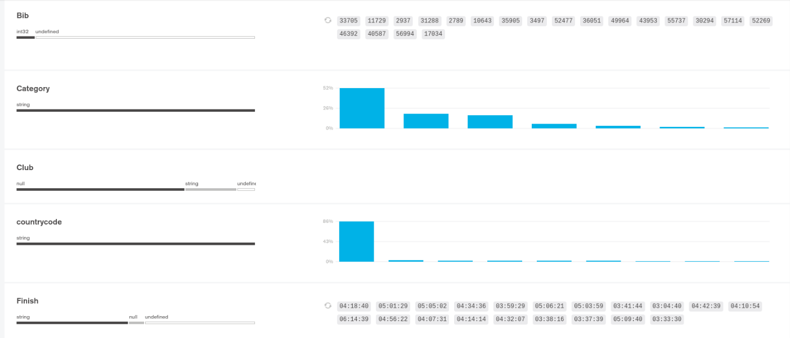
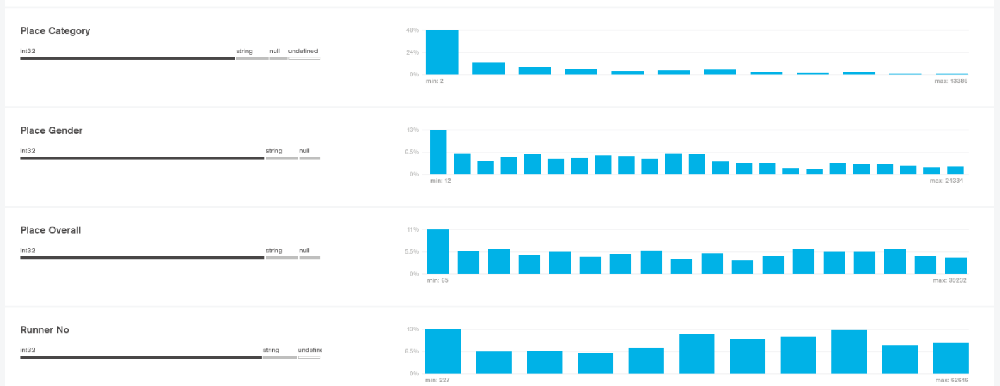

# What

A repo for centralizing the London Marathon datasets as a json. 

# Why 

A substantial amount of duplicate and difficult-to-reuse work has been done on the scraping and analysis of the London Marathon data. This repo will hopefully reduce that going forwards. 

Some examples of cellular work that has been completed can be seen below. 

* https://github.com/Ben-Jamin-Griff/LondonMarathonAnalysis
* https://github.com/eastc5/London_marathon_results_scraper
* https://www.thedataschool.co.uk/brian-scally/dashboard-week-day-2-london-marathon-runners
* https://medium.com/@ramotswa/the-london-marathon-48095245a3b0
* https://towardsdatascience.com/how-to-pace-the-london-marathon-fuelled-by-data-8c62efa50054
* https://rpubs.com/eastc5/252997
* https://content.dsp.co.uk/oracle-analytics-and-the-london-marathon
# Completeness 

full-data.zip currently includes data from 2010 to 2020.

Going forwards I'd like to centralize the most complete possible London marathon dataset here as a json. 

# Analysis 

Todo.

# Data Quality Improvement

Mainly needs to focus on removal of undefined data. A given key should either be of the defined type (e.g string for name) or null. No third category of data should exist. 

